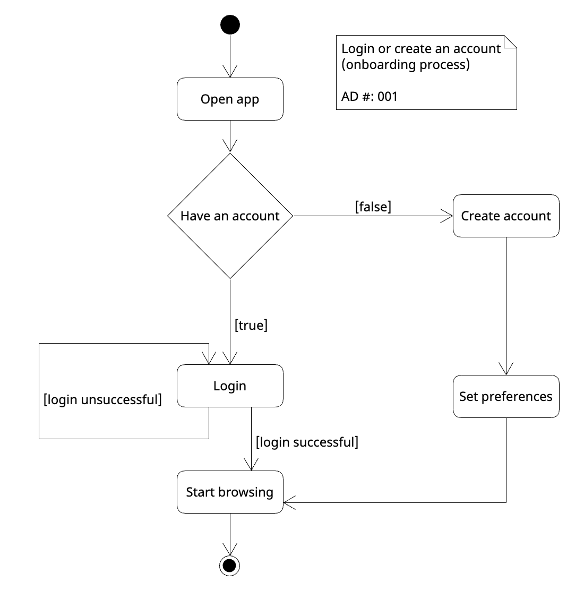

# Specification Phase Exercise

A little exercise to get started with the specification phase of the software development lifecycle. See the [instructions](instructions.md) for more detail.

## Team members

Haley Hobbs: https://github.com/haleyhobbs \
Emma Zhu: https://github.com/ez106 \
Jason Tran: https://github.com/huyy422 \
Jenna Han: https://github.com/jnahan

# Stakeholders

We interviewed two NYU students: Anthony and Will. Both will be living off-campus for their second year this year. Anthony moved to a new apartment this past summer, and Will renewed his lease.

Goals/needs:
- More efficient and reliable ways to find available apartments
- Quick ways to set up tours (and overall communication) with the broker, leasing agency, or whomever is the appropriate point of contact
- A vehicle to facilitate finding potential roommates beyond the scope of their regular social circles
- Finding roommates who share their apartment goals and with whom they are compatible
- Overall making the apartment hunting and roommate search process less daunting/insurmountable

Problems/frustrations:
- Existing apartment search engines are difficult, confusing, time-consuming, exhausting, and defeating
- Existing apartment search engines aren't efficient: your search results are often cluttered with apartments you've already viewed/toured
- Often don't get a response, or it takes too long, after messaging on existing apartment search engines
- It's difficult to find roommates who aren't your friends (or friends of friends), classmates, etc. It's all just by word of mouth, which largely narrows down the pool of potential roommates. There are so many people in search of roommates but there is no efficient way (to our knowledge) of connecting them.
- Even if you are able to find someone, the odds of you being compatible with them and sharing living preferences/styles are slim

## Product Vision Statement

Housemate: modernized apartment hunting to find your next home and roommates all-in-one.

## User Requirements

**1.** As someone looking for new roommates, I want to be able to look through multiple profiles and match with others who are also interested in living with me.

**2.** As someone looking for new roommates, I want to be able to chat in the app with potential roommates without giving out my personal information to see if we are a good fit.

**3.** As someone looking for new roommates, I want to find a roommate with the same move-in date.

**4.** As someone looking for new roommates, I want to create an account and set a filter on criteria such as amenities and location, so I only see users who have the same preferences.

**5.** As someone looking for new roommates, I want to find a roommate who has the same level of cleanliness, noise level, and sleeps at the same time so I can avoid roommate conflict.

**6.** As a user with a pet, I want to find a roommate that is okay with my pet being around.

**7.** As a user who smokes, I want a roommate who doesn't mind the smell or also smokes.

**8.** As a female user, I want to find a female roommate.

**9.** As a user looking for a roommate, I want to be able to see pictures of my potential roommate when browsing.

**10.** As a user, I want to get a notification when I match with a potential roommate.

**11.** As a user with a strict budget, I want to find a roommate who wants something in the same price range.

**12.** As a user, I want to write a little bio on my profile so I am more likely to find a match.

## Activity Diagrams
User story 4:

## Clickable Prototype

See instructions. Delete this line and place a publicly-accessible link to your clickable prototype here.
